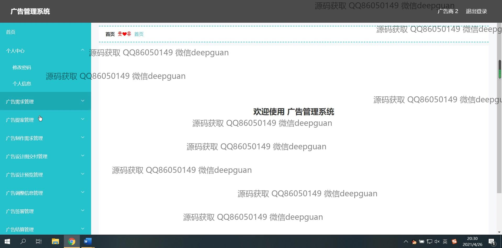
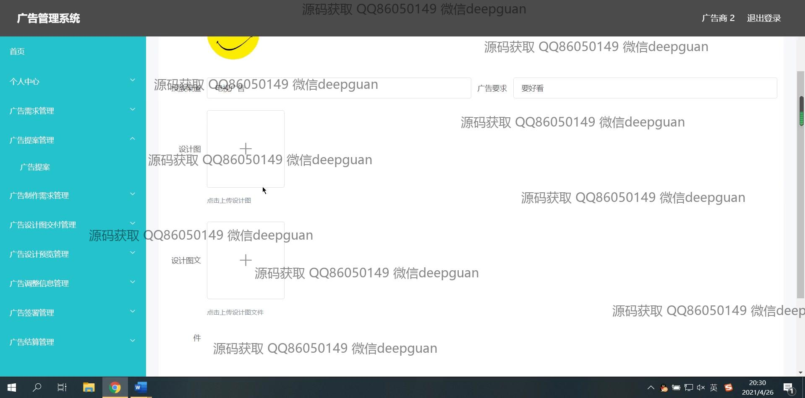

<h1 align="center">广告管理系统+vue</h1>

## 简介
广告管理系统：角色分为管理员、广告客户和广告商；功能包括广告客户管理、广告商管理、广告需求管理、广告设计与调整管理、广告投放与效果分析等，提供全面的广告管理解决方案。    --计算机毕业设计源码；毕设源码；java毕业设计源码

## 联系方式

<h3 align="center">获取完整代码与数据库文件 + 微信：deepguan QQ: 86050149 QQ群: 783742310</h3>

<h3 align="center">可帮忙远程部署 包运行成功！提供远程部署、修改代码、设计文档指导、代码讲解等服务！</h3>

## 功能介绍（完整见运行截图）
管理员：管理员可以登录、注册和退出系统。他们可以访问个人中心查看和修改个人信息，还可以通过导航菜单管理广告客户信息、广告商信息、广告制作商信息、广告需求和投放渠道。管理员可在详细的广告管理界面中查看广告信息、修改、删除和审核广告，管理广告制作需求和设计图交付，控制广告流程的各个阶段，并进行系统用户的注册与权限管理。

广告客户：广告客户需通过注册成为系统用户，并在个人中心查看或编辑个人信息。客户可以提交广告需求，包括填写客户账号、姓名、负责要求、广告内容及相关资源上传。同时，客户可以查看提交的广告提案及进度，并根据提供的预览和效果分析进行内容修改与调整，监控广告发布后的展示量与点击效果。

广告商：广告商通过注册后即可访问系统，管理自己的广告投放项目。功能包括输入和编辑广告信息，如广告名称、封面、投放渠道和结算时间。广告商可查看特定广告的设计预览、监控投放进度及效果，还可与制作商和客户进行沟通，以实现广告提案优化及批准，通过管理界面签署协议与结算。

广告制作商：广告制作商注册后可进入系统进行需求的详细管理和设计图文的编辑，负责广告制作环节，管理包含广告名称、客户及商家信息的广告制作需求。制作商须上传设计文件，满足广告商和客户的制作要求并支持调试、调整广告内容，以便广告需求能得到准确的执行和及时的交付。

## 运行截图

本代码来源于网络,仅供学习参考使用!

